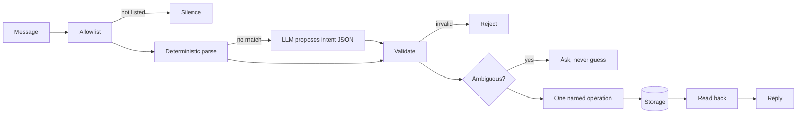

# Bookpile

**An executable specification for a personal reading system.**

Message it *"finished The Tin Almanac today, four stars"* and get a validated
record in a library you own. Where that library lives — Markdown, SQLite, a
Google Sheet, the thing you already use — is an adapter, not a decision this
project makes for you.


Every reply in that transcript is real output from the reference implementation.

## Bookpile is not an app you install

It is a specification, a conformance suite and a fixed safety core, so a coding
agent can inspect the setup you already have, build a reading companion shaped
to it, and **prove the result correct against portable test vectors**.

Two people can run builds that share no code at all — one on Markdown and
Telegram, one on a spreadsheet and a command line — and still hand each other a
library without losing anything, because both honour the same record contract.

> The test of success is an export and re-import, not a resemblance.

## Try it in thirty seconds

```bash
git clone https://github.com/madeforaworld/bookpile
cd bookpile
./scripts/check.sh                       # privacy gate + 43 tests + 51 vectors
python3 -c "
import sys; sys.path[:0] = ['.', 'reference']
from bookpile.adapters import SQLiteRepository
from bookpile.service import LibraryService
from bookpile.intake.cli import CLIIntake
cli = CLIIntake(LibraryService(SQLiteRepository()))
for line in ['add The Tin Almanac by Marguerite Sowande',
             'start The Tin Almanac', 'finished The Tin Almanac', 'The Tin Almanac 4 stars']:
    print('>', line); print(' ', cli.handle(line))
"
```

No credentials, no network, no AI key. Open `site/index.html` in a browser for
the live dashboard.

## How a message becomes a record



Natural language is untrusted input. Model output is an untrusted proposal.
**Only validated named operations may mutate storage.**

## The chart no other tracker can draw

Bookpile stores publication time and narrative time as **two separate clocks**,
so it can plot when a book was written against when its story is set. The
diagonal is the present tense; below it is historical, above it is speculative,
and distance from the line is how far the author was reaching.


Books set in invented worlds have no real-world year, so they are **excluded and
counted**, never plotted at zero.

## A menu, not a dashboard

What you record decides what can be shown. The build asks what you want to know
and builds only those charts — a library with nothing but titles and statuses
gets four tiles and a status bar.


All demo data is a synthetic 30-book fixture. No real reading history appears
anywhere in this repository.

## Where your library lives

| Adapter | Notes |
|---|---|
| **Markdown** | One note per book. Readable, greppable, git-friendly. Shipped. |
| **SQLite** | A single file. Easy to back up and query. Shipped. |
| **Google Sheets** | Cannot hold full re-read history, so it **declares** that limit rather than dropping data. Specified. |
| **Yours** | A generated adapter passes exactly the same vectors. No exemptions. |

## Status

Phases 0–3 built and verified.

```
./scripts/check.sh
  privacy gate     clean
  safety tests     27 passed
  reference tests  16 passed
  vectors          51/51 passed   (sqlite and markdown)
```

**Not verified:** the Telegram network path. Its policy layer — allowlist,
idempotency, audit redaction — is tested, but nothing has spoken to the live
API, because that needs a real bot token. The source says so.

**Not built:** Sheets and PostgreSQL adapters, the projection HTTP API,
`docker compose`, a dashboard wired to a live store rather than the fixture.

## Repository

| | |
|---|---|
| `spec/` | Schema, nine numbered invariants, intents, storage port, API contract. Normative. |
| `conformance/` | 51 vectors in language-agnostic JSON, plus the runner. **The real contract.** |
| `safety/` | Allowlist, validation, idempotency, redaction. Fixed code, never generated. |
| `onboarding/` | What to inspect, what to default, the two questions worth asking. |
| `reference/` | Domain, service, adapters, intake, projection. Evidence the spec is buildable. |
| `docs/METRICS.md` | 25-entry metrics catalogue with acceptance tests. |
| `site/` | The demo dashboard. No backend. |

## Onboarding asks almost nothing

An earlier draft specified nine setup questions. That was wrong — most are
answerable by inspection, and interrogating someone is the lazy route to
customization. Two questions survive, plus one optional, and **a zero-question
path must produce a working build**.

Safety decisions are never inferred toward permissive. Write authority,
allowlist membership and dashboard exposure take the safe default or are asked
outright — never resolved by confidence.

## Licence

Not yet licensed for reuse — see `LICENSE.md`. Intended Apache-2.0, pending a
dependency and provenance review.
