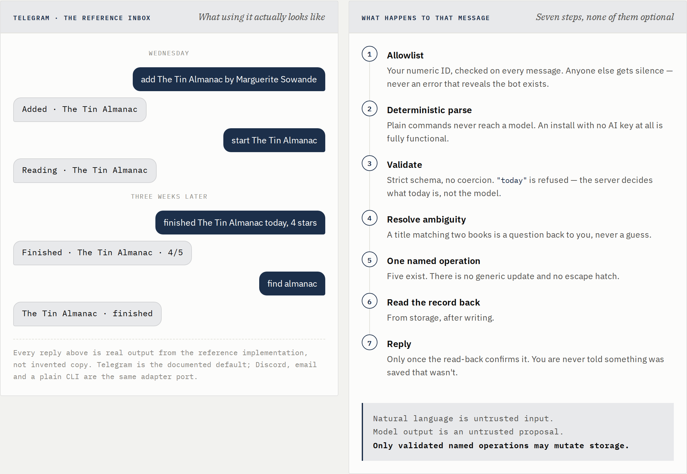
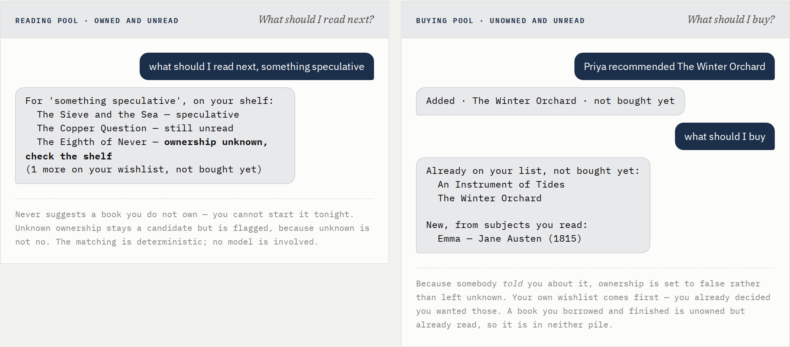
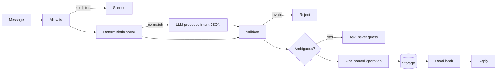
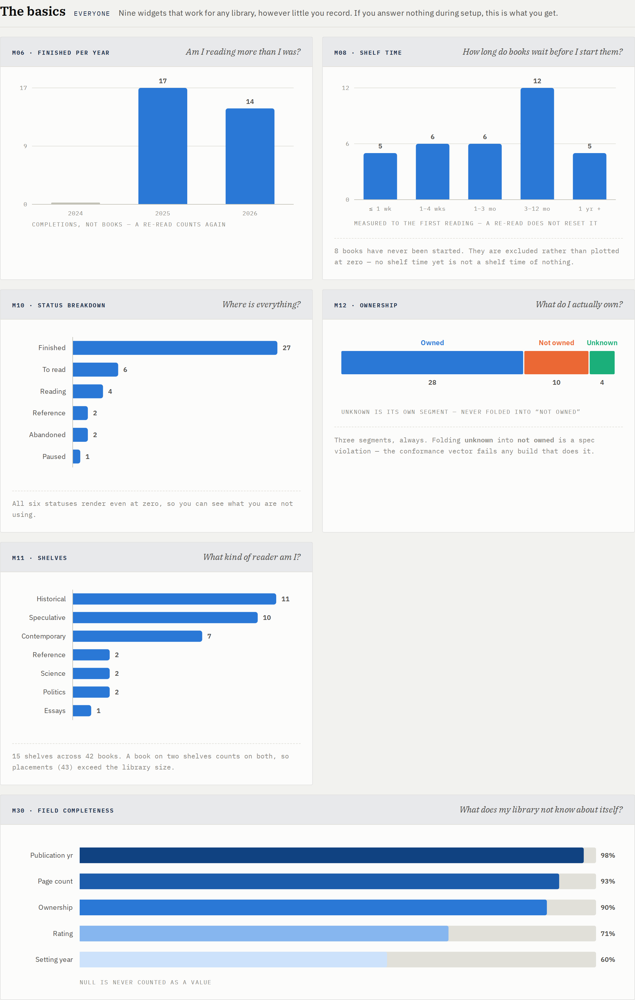
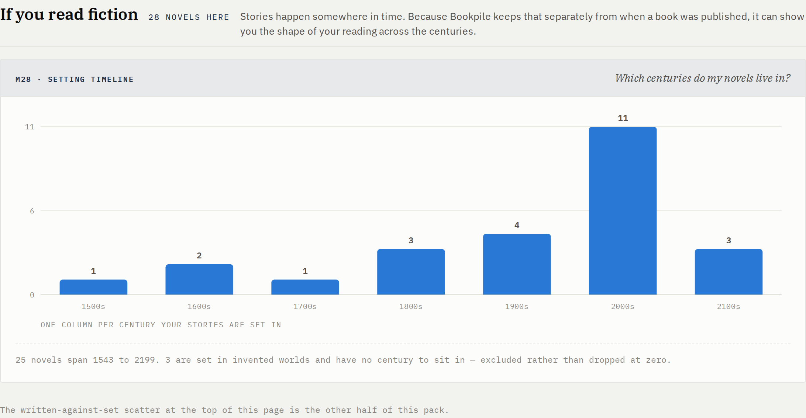
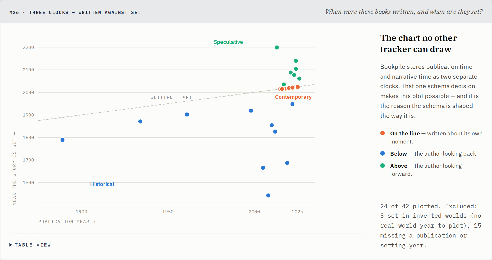
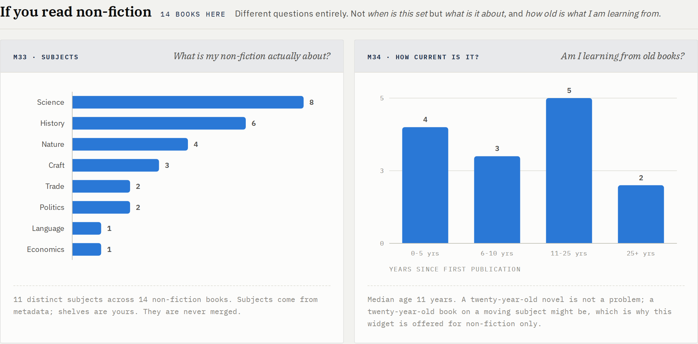

# Bookpile

**For people who love books and want to know what they have actually been reading.**

Tell it what you finished, the way you would tell a friend. It keeps the data in
a library that stays yours.



Every reply in that transcript is real output from the reference implementation.

## Why this exists

Reading apps want your library to live inside them. Bookpile does the opposite:
it agrees on a **shape** for your reading data and leaves the storage to you — a
folder of notes, a database file, a spreadsheet, whatever you already use.

Two people can run builds that share no code at all and still hand each other a
library without losing anything, because both honour the same record contract.

> The test of success is an export and re-import, not a resemblance.

Underneath, Bookpile is a specification, a conformance suite and a fixed safety
core, so a coding agent can inspect the setup you already have, build something
shaped to it, and **prove the result correct against portable test vectors**.

## Try it in thirty seconds

```bash
git clone https://github.com/madeforaworld/bookpile
cd bookpile
./scripts/check.sh                       # privacy gate + 70 tests + 59 vectors
python3 -c "
import sys; sys.path[:0] = ['.', 'reference']
from bookpile.adapters import SQLiteRepository
from bookpile.service import LibraryService
from bookpile.intake.cli import CLIIntake
cli = CLIIntake(LibraryService(SQLiteRepository()))
for line in ['add The Tin Almanac by Marguerite Sowande',
             'start The Tin Almanac', 'finished The Tin Almanac', 'The Tin Almanac 4 stars']:
    print('>', line); print(' ', cli.handle(line))
"
```

No credentials, no network, no AI key. Open `site/index.html` for the live
dashboard.

**It does not need a good model, or any model.** Plain commands are parsed
deterministically and never reach an LLM. That is not a fallback — real
self-hosted deployments run heavily quantised local models, and a system that
only works with a frontier model is not self-hostable.


## Four things people actually do with it

**Someone recommends a book and you will forget it by tomorrow.**

```
you   Priya recommended The Copper Question
bot   Added · The Copper Question · not bought yet · 1987 · 506pp
```

One message. It creates the record, looks up the year, page count, ISBN and
cover art, and — because *recommended* means somebody told you about it — marks
it **not owned** rather than leaving that unknown. You did not say "add to
wishlist, ownership false"; you said what happened.

**Then you buy it.**

```
you   i bought The Copper Question
bot   The Copper Question · owned
```

Buying is not reading. Ownership flips; no reading is fabricated. When you do
start it, `start The Copper Question` opens one.

**You own too many books and cannot choose. Or you want something new.**



Two questions, two piles. *What should I read tonight* means choose from what
you **own**; *what should I buy* means look at what you do not. Conflating them
is how you get told to start a book that is not in the house.

A book you borrowed and finished is unowned but already read — so it is in
neither pile.

## What gets captured

One message produces a complete record. Starred fields are filled in
automatically by the metadata lookup, if you turn it on.

| Field | Example | Notes |
|---|---|---|
| `title` / `authors` | The Lacquer Cabinet · Ines Verhoeven | |
| `status` | `finished` | Current state, not history |
| `form` | `fiction` | Decides which widgets you are offered |
| `owned` | `true` | Three-valued: yes, no, **unknown** |
| `added_at` | 2023-11-19 | Set once, never updated. Shelf time measures from it |
| `readings[]` | 2 entries | The authoritative history — a re-read appends |
| `rating` | 5 | Derived: latest non-null across readings |
| `categories` | Historical | **Your** shelves |
| `subjects` ★ | Trade, Family | Imported. Never merged with your shelves |
| `page_count` ★ | 388 | |
| `first_published` ★ | 2019 | When the book was published |
| `setting.anchor_year` | 1687 | When the *story* happens — a separate clock |
| `setting.kind` | `historical` | historical / contemporary / speculative / fictional |
| `isbn13` ★ | | |
| `cover_ref` ★ | covers.openlibrary.org/… | **Replace-never.** An existing cover is never overwritten |

Enrichment fills **blanks only** — anything you said yourself wins — and it is
never on the critical path. If the lookup is slow, offline or wrong, the book
is still added.

## How a message becomes a record



Natural language is untrusted input. Model output is an untrusted proposal.
**Only validated named operations may mutate storage.**

## The widgets fit what you read

You do not get whatever charts we happened to build. A novel reader and a
history reader want genuinely different things, and both get the basics.

### The basics — everyone

Nine widgets that work for any library, however little you record. Answer
nothing during setup and this is what you get.



### If you read fiction

Stories happen somewhere in time. Because Bookpile keeps *when a story is set*
separately from *when the book was published*, it can show you the shape of your
reading across the centuries.



And the chart nothing else can draw — publication year against setting year. The
diagonal is the present tense, below it is historical, above it is speculative,
and distance from the line is how far the author was reaching.



Books set in invented worlds have no real-world year, so they are **excluded and
counted**, never plotted at zero.

### If you read non-fiction

Different questions entirely. Not *when is this set* but *what is it about*, and
*how old is what I am learning from*.



A twenty-year-old novel is not a problem. A twenty-year-old book on a moving
subject might be — which is why that widget is offered for non-fiction only.

## Where your library lives

**Examples, not a menu.** Anything that can hold a record and pass the
conformance vectors qualifies.

| | |
|---|---|
| **Markdown** | One note per book. Readable, greppable, git-friendly. Shipped. |
| **SQLite** | A single file. Easy to back up and query. Shipped. |
| **Google Sheets** | Cannot hold full re-read history, so it *declares* that limit rather than quietly dropping data. Specified. |
| **Notion, Airtable, a folder of text files…** | Anything else. A generated adapter passes exactly the same vectors — no exemptions for being bespoke. |

## Status

```
./scripts/check.sh
  privacy gate     clean
  safety tests     27 passed
  reference tests  43 passed
  vectors          66/66 executions passed
                   59 distinct; storage runs on both adapters
```

**Telegram, precisely.** Tested against a stubbed transport: allowlist,
idempotency, poll-offset advancement, reply routing, audit redaction. **Not
tested:** the actual HTTPS call to `api.telegram.org`, which needs a live bot
token. The approach is proven — the author runs a Telegram reading bot daily —
but *this* adapter has never opened a socket, and the source says so.

**Metadata and discovery** run against the live Open Library API and were
verified end to end — enrichment returned year, page count, ISBN and a cover
URL; discovery returned books absent from the library. Both are **opt-in**: with
no provider configured Bookpile never touches the network.

**Not built:** Sheets and PostgreSQL adapters, the projection HTTP API,
`docker compose`, a dashboard wired to a live store rather than the fixture.

**Known weak:** discovery returns famous books rather than interesting ones —
it queries your *commonest* subjects, which is backwards. See `ROADMAP.md`,
which is written to be honest about this rather than to advertise.

## Repository

| | |
|---|---|
| `spec/` | Schema, nine numbered invariants, intents, storage port, API contract. Normative. |
| `conformance/` | 59 vectors in language-agnostic JSON, plus the runner. **The real contract.** |
| `safety/` | Allowlist, validation, idempotency, redaction. Fixed code, never generated. |
| `onboarding/` | What to inspect, what to default, the two questions worth asking. |
| `reference/` | Domain, service, adapters, intake, metadata, projection. Evidence the spec is buildable. |
| `docs/METRICS.md` | 29-entry metrics catalogue with acceptance tests and widget packs. |
| `site/` | The demo dashboard. No backend. |

All demo data is a synthetic 42-book fixture. No real reading history appears
anywhere in this repository.

## Setup asks almost nothing

An earlier draft specified nine setup questions. That was wrong — most are
answerable by inspection, and interrogating someone is the lazy route to
customization. Two questions survive, plus one optional, and **a zero-question
path must produce a working build**.

Safety decisions are never inferred toward permissive. Write authority,
allowlist membership and dashboard exposure take the safe default or are asked
outright — never resolved by confidence.

## Licence

Not yet licensed for reuse — see `LICENSE.md`. Intended Apache-2.0, pending a
dependency and provenance review.
